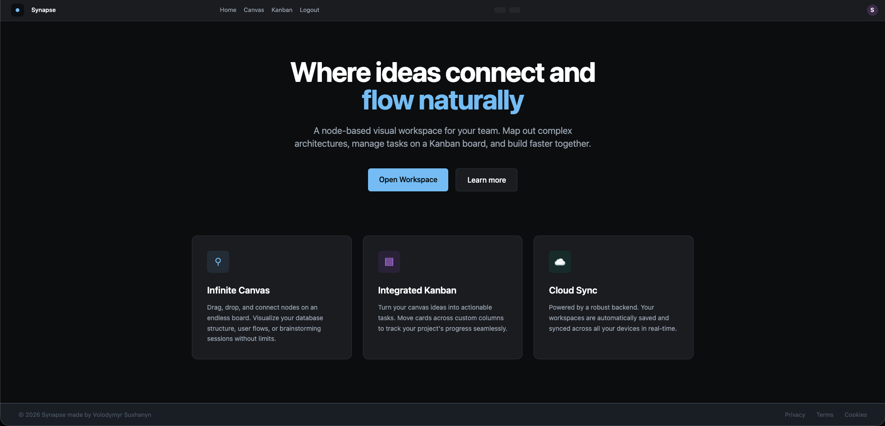
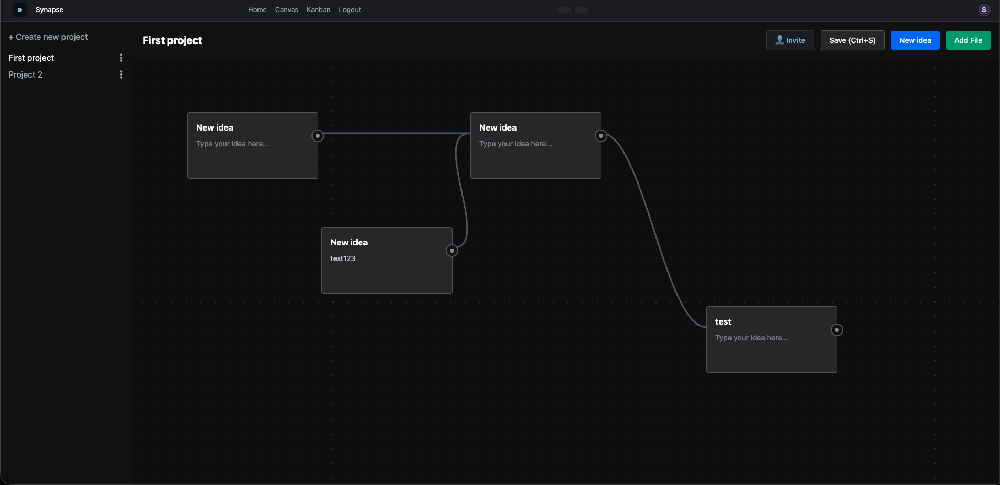
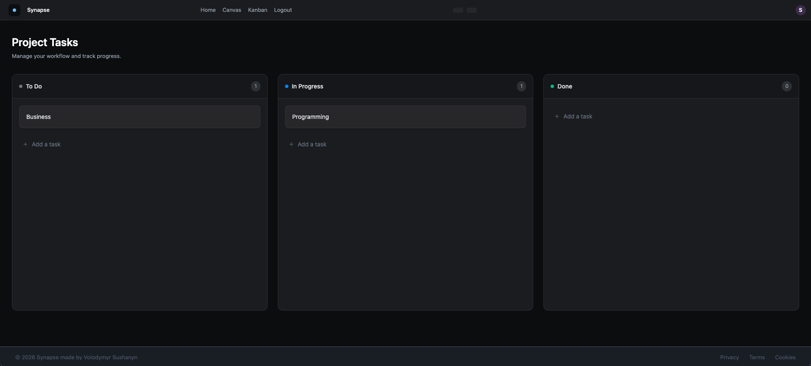
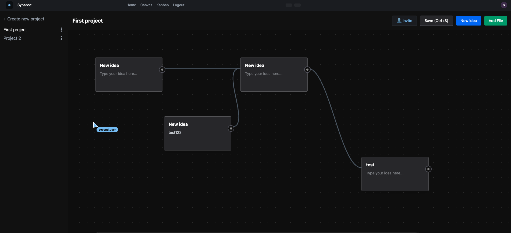

<div align="center">
  
  <h1>Synapse</h1>
  <p><strong>A node-based visual workspace for ideas, architecture, and task management.</strong></p>

  
  
  
  
  
  
</div>

---

## ✨ Overview

**Synapse** is a modern, dark-themed productivity app that combines an **infinite canvas** for visual thinking with an **integrated Kanban board** for task tracking — all powered by real-time collaboration and cloud sync via Supabase.

Whether you're mapping out a database schema, brainstorming product ideas, or tracking your team's sprint, Synapse gives you one unified workspace — with live multiplayer cursors so your whole team can work together simultaneously.


## 📸 Screenshots
<table>
  <tr>
    <td></td>
    <td></td>
    <td></td>
    <td></td>
  </tr>
</table>

## 🚀 Features

### 🎨 Infinite Canvas
- Create multiple **projects** in a sidebar
- Add **idea nodes** anywhere on an infinite, pannable, zoomable board
- **Connect nodes** by dragging from the connector handle on any card
- Smooth **Bezier curve connections** rendered via SVG
- Rename projects inline with double-click
- Upload **images and PDFs** directly onto the canvas (stored in Supabase Storage)
- **Save with Ctrl+S** or the Save button — persisted to your Supabase backend

### 👥 Real-Time Collaboration
- **Live multiplayer cursors** — see where your teammates are on the canvas in real time, with their username displayed next to their cursor
- **Share a secret link** — anyone with the `?room=<id>` URL joins the same live board instantly, no account required for viewing
- **Invite via email** — send invitations directly from the Invite modal inside the canvas
- Board state **broadcasts on save** — when you save, all connected collaborators instantly receive the updated layout
- Powered by **Supabase Realtime** channels (throttled cursor broadcast at ~20fps for smooth performance)

### 📋 Kanban Board
- Three default columns: **To Do**, **In Progress**, **Done**
- Add tasks to any column with a quick inline form
- **Drag and drop** cards between columns
- Delete tasks with a single click
- All tasks synced to Supabase in real-time (per user)

### 🔐 Authentication
- Email/password **sign up & login** via Supabase Auth
- Persistent sessions — stay logged in across page reloads
- All data is **scoped to the authenticated user**
- Avatar initial shown in the header

### ☁️ Cloud Sync
- Canvas projects and Kanban tasks stored in **Supabase (PostgreSQL)**
- File uploads stored in **Supabase Storage**
- Works across devices — just log in

---

## 🛠️ Tech Stack

| Layer | Technology |
|---|---|
| Framework | React 19 |
| Build Tool | Vite 8 |
| Styling | Tailwind CSS 4 |
| Routing | React Router DOM 7 |
| Backend / Auth / DB | Supabase |
| Icons | React Icons |

---

## 📁 Project Structure

```
synapse/
├── public/
│   ├── favicon.png
│   ├── logo-black.svg
│   └── logo-white.svg
├── src/
│   ├── components/          # Reusable UI components
│   │   ├── Button.jsx
│   │   ├── Footer.jsx
│   │   ├── Header.jsx
│   │   ├── LoginForm.jsx
│   │   ├── Sidebar.jsx
│   │   └── Status.jsx
│   ├── hooks/
│   │   └── useAuth.js       # Auth state, login, register, logout
│   ├── layouts/
│   │   └── AppLayout.jsx    # Shared page shell (header + outlet)
│   ├── lib/
│   │   └── supabase.js      # Supabase client init
│   ├── pages/
│   │   ├── Auth.jsx         # Login / Register page
│   │   ├── Canvas.jsx       # Infinite canvas with node editor
│   │   ├── Kanban.jsx       # Drag-and-drop task board
│   │   ├── Home.jsx         # Landing / feature overview
│   │   └── ErrorPage.jsx    # 404 fallback
│   ├── App.jsx              # Route definitions & auth guards
│   └── main.jsx             # Entry point
├── index.html
├── vite.config.js
└── package.json
```

---

## ⚙️ Getting Started

### Prerequisites

- Node.js 18+
- A [Supabase](https://supabase.com) project

### 1. Clone the repository

```bash
git clone https://github.com/your-username/synapse.git
cd synapse
```

### 2. Install dependencies

```bash
npm install
```

### 3. Set up environment variables

Create a `.env` file in the root of the project:

```env
VITE_SUPABASE_URL=https://your-project-id.supabase.co
VITE_SUPABASE_PUBLISHABLE_KEY=your-anon-public-key
```

You can find both values in your Supabase project under **Settings → API**.

### 4. Set up Supabase tables

Run the following SQL in your Supabase **SQL Editor**:

```sql
-- Kanban tasks
create table kanban_tasks (
  id uuid primary key,
  user_id uuid references auth.users not null,
  title text not null,
  status text not null default 'todo',
  created_at timestamp with time zone default now()
);

-- Enable Row Level Security
alter table kanban_tasks enable row level security;

create policy "Users can manage their own tasks"
  on kanban_tasks for all
  using (auth.uid() = user_id);

-- Canvas projects (optional — if you persist to Supabase)
create table canvas_projects (
  id uuid primary key,
  user_id uuid references auth.users not null,
  title text,
  ideas jsonb,
  connections jsonb,
  created_at timestamp with time zone default now()
);

alter table canvas_projects enable row level security;

create policy "Users can manage their own projects"
  on canvas_projects for all
  using (auth.uid() = user_id);

-- Enable Realtime for live collaboration
alter publication supabase_realtime add table canvas_projects;
```

### 5. Run the development server

```bash
npm run dev
```

Open [http://localhost:5173](http://localhost:5173) in your browser.

---

## 📦 Available Scripts

| Command | Description |
|---|---|
| `npm run dev` | Start the Vite dev server |
| `npm run build` | Build for production |
| `npm run preview` | Preview the production build locally |
| `npm run lint` | Run ESLint |

---

## 🗺️ Roadmap

- [x] Real-time collaboration with live cursors (Supabase Realtime)
- [x] Invite collaborators via secret link or email
- [ ] Node color themes and resizable cards
- [ ] Export canvas as PNG / PDF
- [ ] Keyboard shortcuts for canvas actions
- [ ] Markdown support inside idea cards
- [ ] Mobile-responsive layout

---

## 🤝 Contributing

Contributions are welcome! Please open an issue first to discuss what you'd like to change, then submit a pull request.

1. Fork the project
2. Create your feature branch: `git checkout -b feature/my-feature`
3. Commit your changes: `git commit -m 'Add my feature'`
4. Push to the branch: `git push origin feature/my-feature`
5. Open a Pull Request

---

## 📄 License

This project is licensed under the [MIT License](LICENSE).

---
